# Driver Database System — Complete Design Document

## 1. System Overview

The City Driver Database Management System manages ~100 driver records with:
- **Fast O(1) search** by license number via hash table
- **Positional insertion** (beginning, end, by county)
- **N most/least recent** licenses via Stack/Queue
- **Migration** to inactive database
- **Custom data structures** only (no STL)
- **Composition + Inheritance** design

---

## 2. Complete Class Hierarchy and Relationships

### 2.1 Value Classes (Composition Building Blocks)

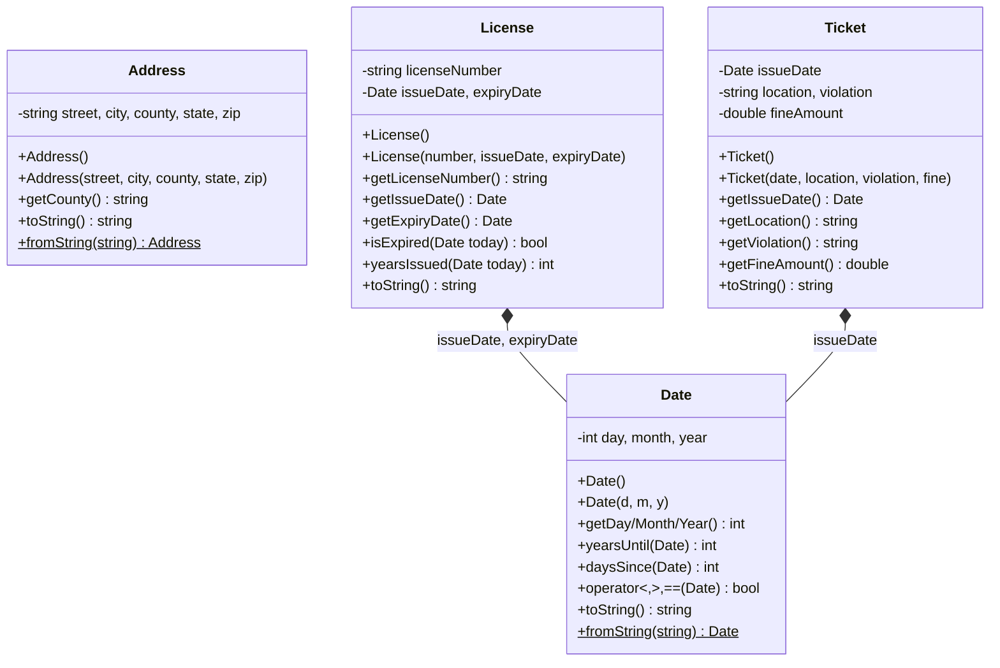

### 2.2 Driver Inheritance Hierarchy

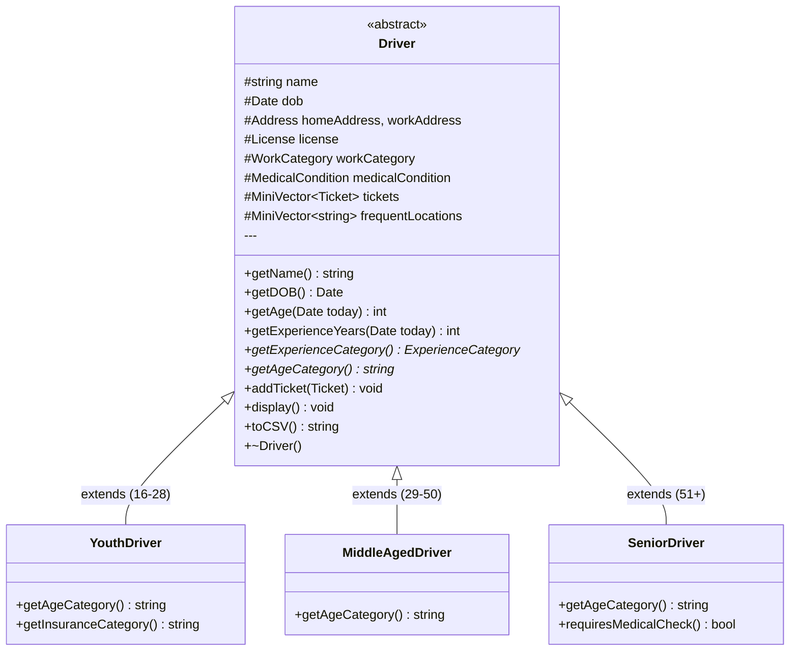

### 2.3 Driver Composition

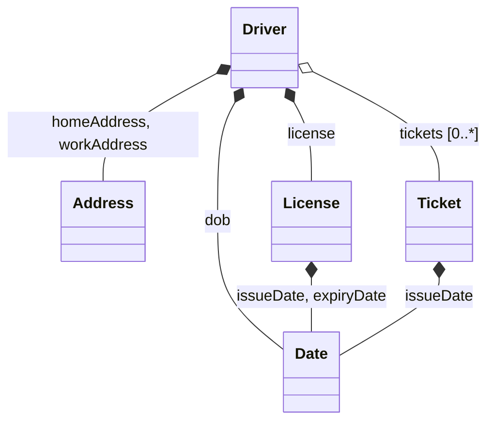

### 2.4 DriverDatabase Architecture

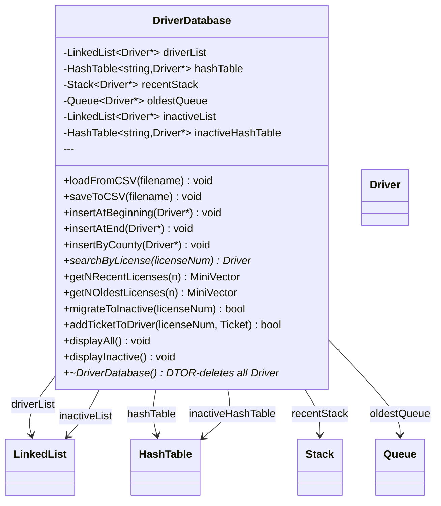

### 2.5 DriverFactory Pattern

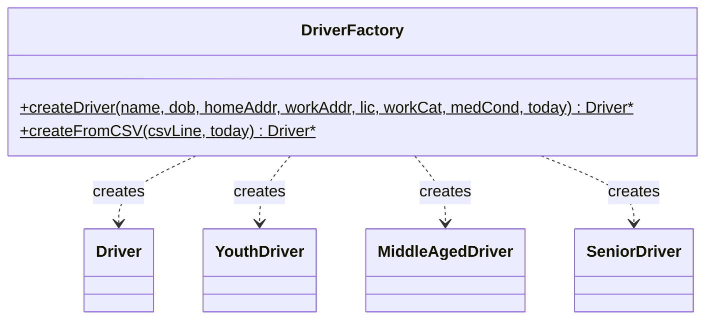

---

## 3. Enumerations and Constants

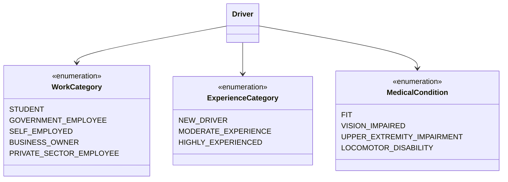

---

## 4. Custom Data Structures

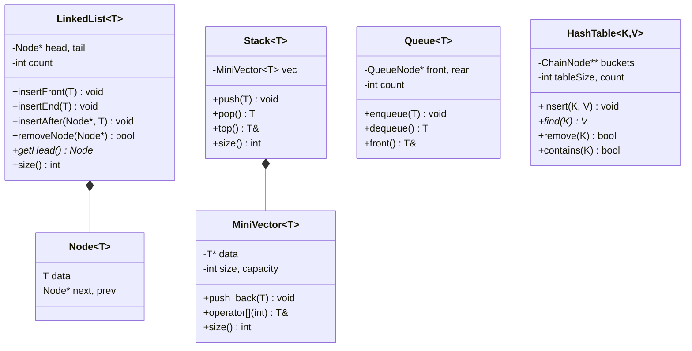

---

## 5. Main Program Flow

### 5.1 System Initialization

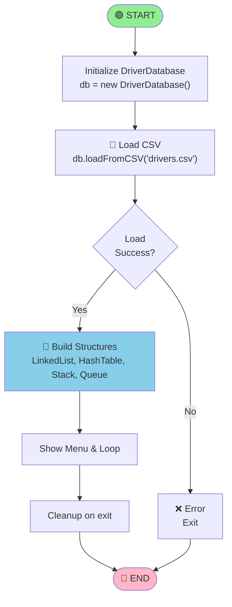

### 5.2 Insert Driver Sub-Flow

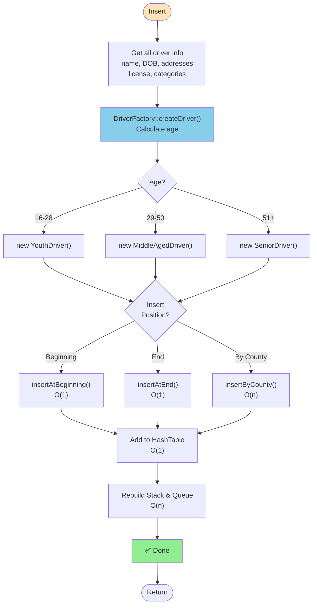

### 5.3 Search by License

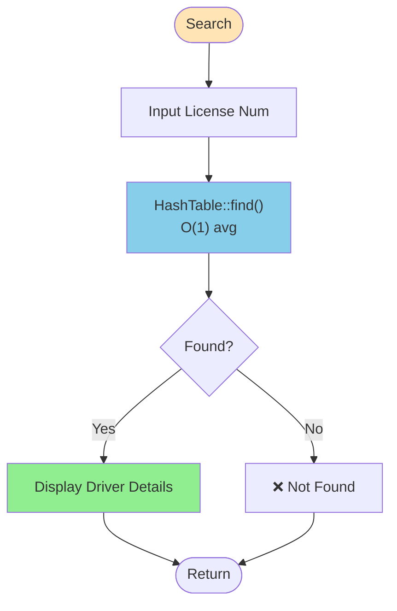

### 5.4 Get N Most Recent Licenses

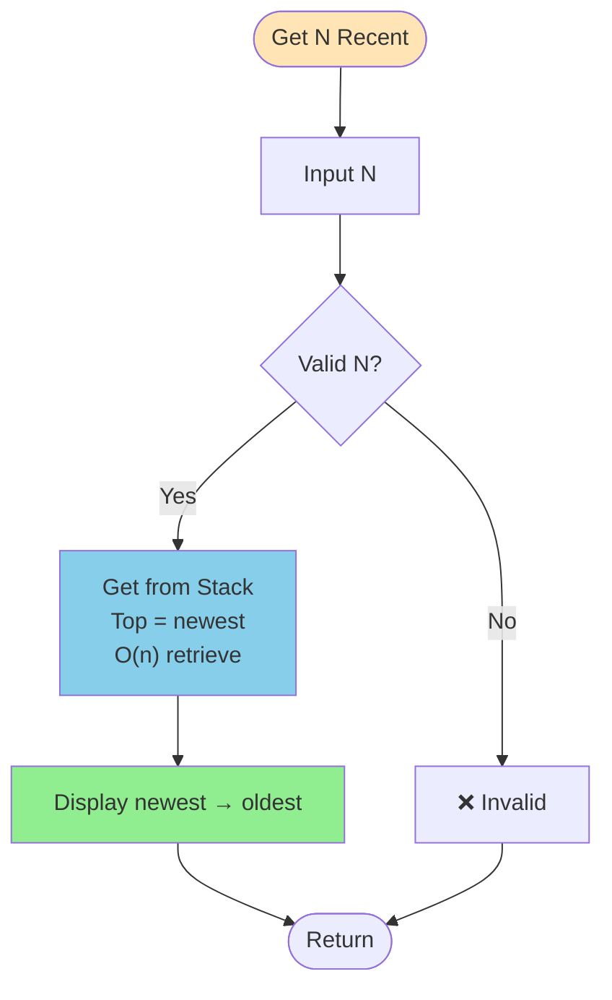

### 5.5 Get N Oldest Licenses


### 5.6 Migrate to Inactive

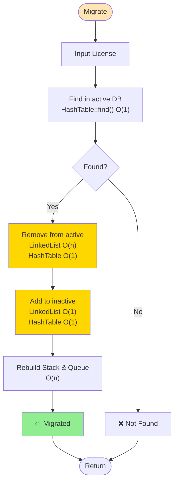

---

## 6. Key Algorithms with Complexity

### 6.1 Search By License — O(1) Average

```
ALGORITHM SearchByLicense(licenseNumber) → Driver*:
    1. h = hash(licenseNumber) MOD tableSize
    2. chain = buckets[h]
    3. WHILE chain ≠ NULL:
           IF chain.key == licenseNumber:
               RETURN chain.value    // O(1) found
           chain = chain.next
    4. RETURN NULL    // O(1) not found
    
    TIME: O(1) average, O(n) worst (collisions)
```

### 6.2 Insert at Beginning / End — O(1)

```
ALGORITHM InsertAtBeginning(Driver*):
    1. driverList.insertFront(driver)   // O(1)
    2. hashTable.insert(license, driver) // O(1)
    3. rebuildStackAndQueue()            // O(n)
    
    TOTAL: O(n) due to rebuild

ALGORITHM InsertAtEnd(Driver*):
    1. driverList.insertEnd(driver)    // O(1)
    2. hashTable.insert(license, driver) // O(1)
    3. rebuildStackAndQueue()           // O(n)
    
    TOTAL: O(n) due to rebuild
```

### 6.3 Insert By County (Grouped) — O(n)

```
ALGORITHM InsertByCounty(Driver*):
    1. targetCounty = driver.homeAddress.county
    2. TRAVERSE linkedList to find last node with targetCounty
       lastMatch = NULL
       FOR each node in driverList:    // O(n)
           IF node.county == targetCounty:
               lastMatch = node
           ELSE IF node.county > targetCounty:
               BREAK
    
    3. INSERT at position:
       IF lastMatch ≠ NULL:
           driverList.insertAfter(lastMatch, driver)
       ELSE:
           driverList.insertFront(driver)
    
    4. hashTable.insert(license, driver)  // O(1)
    5. rebuildStackAndQueue()             // O(n)
    
    TIME: O(n)
```

### 6.4 Get N Most Recent Licenses — O(n)

```
ALGORITHM GetNRecentLicenses(n) → MiniVector<Driver*>:
    1. result = empty MiniVector
    2. IF n < 1 OR n > activeCount:
           RETURN empty
    
    3. stack has newest on top (last pushed)
    4. FOR idx from stack.size()-1 down to 0:  // O(n)
           IF result.size() < n:
               result.push_back(stack[idx])
    
    5. RETURN result    // Newest first
    
    TIME: O(n) retrieval + O(n) stack rebuild per insertion
```

### 6.5 Get N Oldest Licenses — O(n)

```
ALGORITHM GetNOldestLicenses(n) → MiniVector<Driver*>:
    1. result = empty MiniVector
    2. IF n < 1 OR n > activeCount:
           RETURN empty
    
    3. queue has oldest at front (first enqueued)
    4. node = queue.front()
       FOR i = 0 to min(n, queue.size())-1:  // O(n)
           result.push_back(node.data)
           node = node.next
    
    5. RETURN result    // Oldest first
    
    TIME: O(n) retrieval + O(n) queue rebuild per insertion
```

### 6.6 Migrate Driver to Inactive — O(n)

```
ALGORITHM MigrateDriver(licenseNumber) → bool:
    1. driver = hashTable.find(licenseNumber)  // O(1)
       IF driver == NULL:
           RETURN false
    
    2. Find node in linkedList:          // O(n)
       node = NULL
       FOR each n in driverList:
           IF n.license == licenseNumber:
               node = n; BREAK
    
    3. driverList.removeNode(node)       // O(1)
    4. hashTable.remove(licenseNumber)   // O(1)
    5. inactiveList.insertEnd(driver)    // O(1)
    6. inactiveHashTable.insert(license, driver)  // O(1)
    7. rebuildStackAndQueue()            // O(n)
    
    RETURN true
    TIME: O(n)
```

### 6.7 Driver Factory — Age Calculation — O(1)

```
ALGORITHM CreateDriver(..., today) → Driver*:
    1. age = today.yearsUntil(dob)      // O(1)
    2. IF age <= 28:
           RETURN new YouthDriver(...)
       ELSE IF age <= 50:
           RETURN new MiddleAgedDriver(...)
       ELSE:
           RETURN new SeniorDriver(...)
    
    TIME: O(1)
```

---

## 7. Data Flow Diagrams

### 7.1 System Level

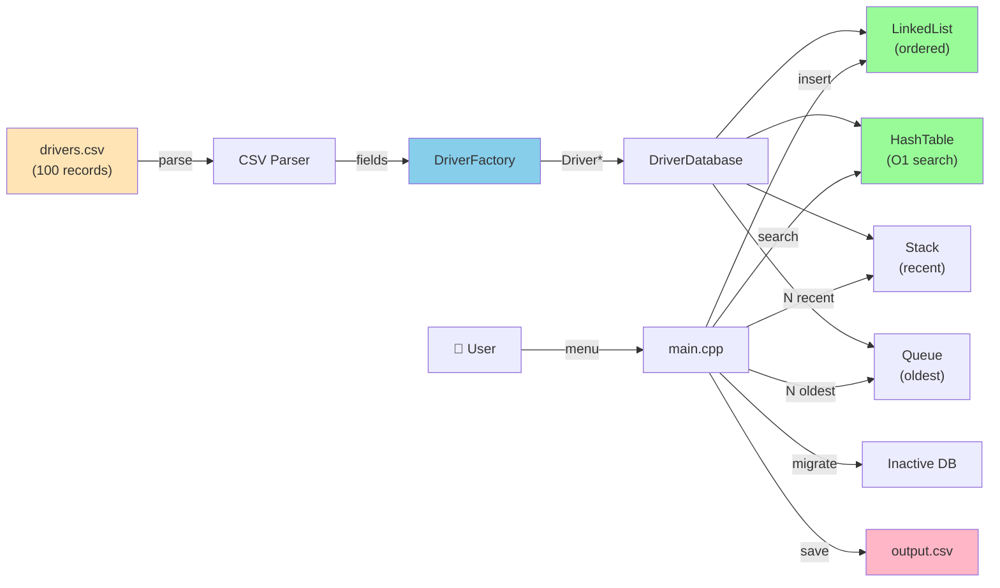

### 7.2 Driver Lifecycle

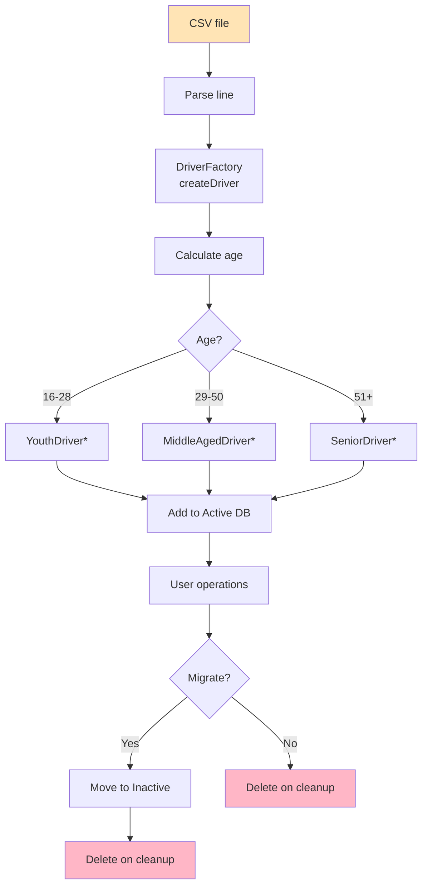

---

## 8. Requirements Fulfillment

| # | Requirement | Solution | Complexity |
|---|---|---|---|
| 1 | Store driver info | Composition: Date, Address, License, Ticket | — |
| 2 | Age classification | Inheritance: YouthDriver, MiddleAgedDriver, SeniorDriver | — |
| 3 | Work categories | Enum WorkCategory | — |
| 4 | Experience categories | Enum ExperienceCategory (computed) | — |
| 5 | Medical conditions | Enum MedicalCondition | — |
| 6 | Insert at beginning | LinkedList::insertFront() | **O(1)** |
| 7 | Insert at end | LinkedList::insertEnd() | **O(1)** |
| 8 | Insert by county | LinkedList::insertByCounty() | O(n) |
| 9 | Fast search | HashTable with djb2 hash | **O(1)** avg |
| 10 | N most recent | Stack (newest on top) | O(n) |
| 11 | N oldest | Queue (oldest at front) | O(n) |
| 12 | Migration | Remove active, add inactive | O(n) search |
| 13 | No STL | Custom MiniVector, LinkedList, Stack, Queue, HashTable | — |
| 14 | Compile | Makefile for g++ | — |
| 15 | Load from file | loadFromCSV() | O(n) |
| 16 | Save to file | saveToCSV() | O(n) |

---

## 9. Memory Management

**DriverDatabase OWNS all Driver pointers:**

- Single allocation per driver via DriverFactory
- LinkedList, HashTable, Stack, Queue all reference same Driver* object
- NO deep copying during migration (pointer reassignment only)
- ALL Driver* deleted in ~DriverDatabase() destructor

```cpp
~DriverDatabase() {
    // Delete all active drivers
    Node<Driver*>* current = driverList.getHead();
    while (current) {
        delete current->data;
        current = current->next;
    }
    // Delete all inactive drivers
    current = inactiveList.getHead();
    while (current) {
        delete current->data;
        current = current->next;
    }
}
```

---

## 10. Design Patterns

1. **Factory** — DriverFactory encapsulates polymorphic creation
2. **Strategy** — User selects insertion strategy (beginning, end, county)
3. **Template Method** — Generic data structures (templated classes)
4. **Composition** — Value objects (Date, Address, License, Ticket) composed in Driver

---

## 11. CSV Format

**Pipe-delimited** with semicolon/colon for nested data:

```
Name|DOB(DD/MM/YYYY)|HomeStreet|HomeCity|HomeCounty|HomeState|HomeZip|WorkStreet|WorkCity|WorkCounty|WorkState|WorkZip|LicenseNumber|IssueDate(DD/MM/YYYY)|ExpiryDate(DD/MM/YYYY)|WorkCategory(1-5)|MedicalCondition(1-4)|FrequentLocations|Tickets
```

---

## 12. Implementation Tips

- **Age**: Date::yearsUntil() for driver age from DOB
- **Experience**: Date::daysSince() from license issue date
- **Sorting**: License issue date is KEY for Stack/Queue correctness
- **Rebuild**: After each insertion/migration, call rebuildStackAndQueue()
- **Cleanup**: Destructor must delete all Driver* pointers
- **Consistency**: Same Driver* referenced in all 4 active structures

